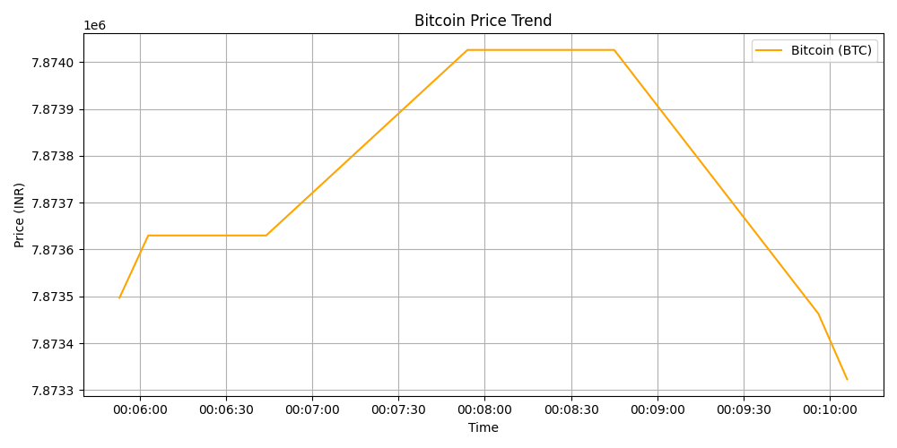

# 🐍 Python Data Engineering Portfolio

A collection of Python-based Data Engineering projects focusing on ETL pipelines, automation, and data simulation.

## 📂 Projects

### 1. 📈 Crypto Sniper Bot (Basic)
**Tech Stack:** Python, SQLite, CoinGecko API, Pandas
- A foundational ETL script that fetches live Bitcoin & Ethereum prices every 10 seconds.
- Uses a simple `while` loop with `time.sleep()` for scheduling.
- Stores raw logs in a structured SQL database.

### 2. 🛒 E-Commerce Data Simulator

**Tech Stack:** Python, Random (Simulation), Pandas, SQLite
- A synthetic data generator that simulates 1,000+ customer orders for a fake retail store.
- Designed to stress-test data ingestion logic by generating random Cities, Products, and Prices.
- Includes an **Analytics Dashboard** that calculates Total Revenue, Top Cities, and Best-Selling Categories.

### 3. 🤖 MarketMood: Real-Time AI Sentiment Analysis

**Tech Stack:** Python, Streamlit, TextBlob (NLP), Plotly, Pandas
- A full-stack data application that processes live financial news feeds to gauge market sentiment.
- **Data Pipeline:** Simulates streaming text data ingestion.
- **AI/ML Engine:** Uses Natural Language Processing (TextBlob) to calculate polarity scores (Positive/Negative/Neutral) in real-time.
- **Visualization:** Renders a live-updating interactive dashboard with moving averages and trend lines using Plotly and Streamlit Session State.

### 4. 🚀 Crypto Sniper V2 (Airflow Pipeline)

**Tech Stack:** Apache Airflow, Python, SQLite, Matplotlib, Pandas
- An advanced version of the Crypto Sniper, orchestrated using **Apache Airflow DAGs**.
- **Orchestration:** Automates the extraction and loading process on a strict schedule.
- **Visualization:** Includes a specialized script (`visualize_crypto.py`) that generates trend graphs from the database.
- **Data Quality:** Implements robust error handling and API rate-limit management.

---

## 🚀 How to Run

1. **Clone the repository:**
   ```bash
   git clone [https://github.com/datawithsumit/Data-Engineering-Portfolio.git](https://github.com/datawithsumit/Data-Engineering-Portfolio.git)
2. **Navigate to a project folder: (Example: Sentiment Dashboard)**
   ```bash
   cd 03_Sentiment_Dashboard
3. **Install Dependencies:**
   ```bash
   pip install -r requirements.txt
4. **Run the specific project:**
   For MarketMood:
         ```bash
      streamlit run app.py
    For Crypto V2 (Airflow): (Ensure Airflow is running, or run the script manually) 
      ```bash
      python crypto_sniper.py
  For E-Commerce Simulator:
   ```bash
            python setup_ecommerce.py
